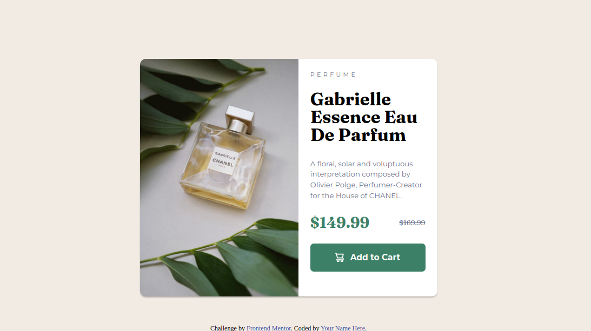
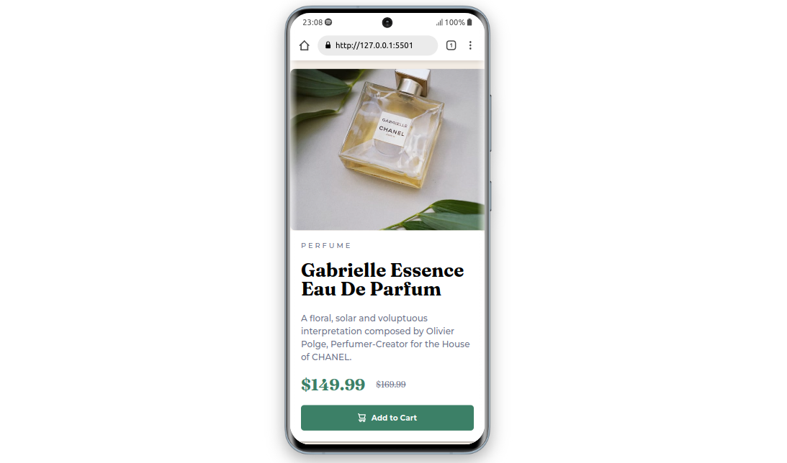

# Frontend Mentor - Product preview card component solution

This is a solution to the [Product preview card component challenge on Frontend Mentor](https://www.frontendmentor.io/challenges/product-preview-card-component-GO7UmttRfa). Frontend Mentor challenges help you improve your coding skills by building realistic projects. 

## Table of contents

- [Overview](#overview)
  - [The challenge](#the-challenge)
  - [Screenshot](#screenshot)
  - [Links](#links)
- [My process](#my-process)
  - [Built with](#built-with)
  - [What I learned](#what-i-learned)
- [Author](#author)
- [Acknowledgments](#acknowledgments)

## Overview

### The challenge

Users should be able to:

- View the optimal layout depending on their device's screen size
- See hover and focus states for interactive elements

### Screenshot

##### Desktop-view

##### Mobile-view

 

### Links

- Solution URL: [Add solution URL here](https://github.com/akashmishrahaha/product-card.git)
- Live Site URL: [Add live site URL here](https://github.com/akashmishrahaha/product-card.git)

## My process

### Built with

- Semantic HTML5 markup
- CSS custom properties
- Flexbox
- CSS Grid
- Mobile-first workflow

### What I learned

I revised my concept of flexbox and grid and also how to make websites responsive.

## Author

- Website - [Akash Mishra](https://github.com/akashmishrahaha)
- Frontend Mentor - [@akashmishrahaha](https://www.frontendmentor.io/profile/akashmishrahaha)
- Twitter - [@akashmishrahaha](https://www.twitter.com/akashmishrahaha)

## Acknowledgments

I would like to thank my peers and frontend mentor community for their guidance.
